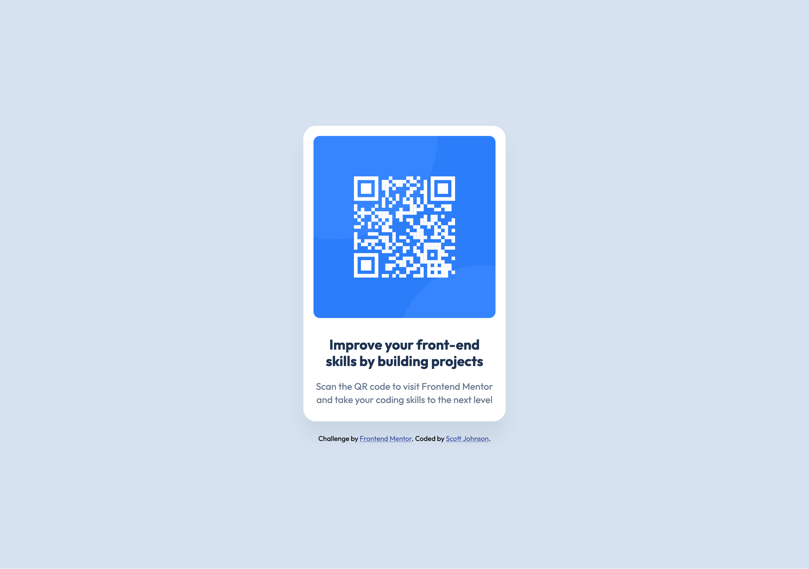

# Frontend Mentor - QR code component solution

This is a solution to the [QR code component challenge on Frontend Mentor](https://www.frontendmentor.io/challenges/qr-code-component-iux_sIO_H). Frontend Mentor challenges help you improve your coding skills by building realistic projects.

## Table of contents

- [Overview](#overview)
  - [Screenshot](#screenshot)
  - [Links](#links)
- [My process](#my-process)
  - [Built with](#built-with)
  - [What I learned](#what-i-learned)
  - [Continued development](#continued-development)
  - [Useful resources](#useful-resources)
- [Author](#author)

## Overview

### Screenshot



### Links

- [Solution URL](https://your-solution-url.com)
- [Live Site URL](https://qr-code-challenge-hazel.vercel.app/)

## My process

### Built with

- Semantic HTML5 markup
- CSS custom properties
- Flexbox
- Mobile-first workflow
- Google Fonts (Outfit)

### What I learned

This project helped me practice fundamental CSS layout techniques and responsive design. I focused on creating a clean, centered component using Flexbox and implementing the exact color scheme and typography specified in the style guide.

Key learnings include:
- Using HSL color values for more intuitive color management
- Implementing proper semantic HTML structure with `<main>` and heading hierarchy
- Creating responsive designs that work across different screen sizes
- Separating concerns by moving CSS to external stylesheets

```html
<main class="qr-component">
  
  <h1 class="qr-title">Improve your front-end skills by building projects</h1>
  <p class="qr-description">Scan the QR code to visit Frontend Mentor and take your coding skills to the next level</p>
</main>
```

```css
.qr-component {
  background-color: hsl(0, 0%, 100%);
  border-radius: 20px;
  padding: 16px;
  max-width: 320px;
  width: 100%;
  text-align: center;
  box-shadow: 0 25px 25px rgba(0, 0, 0, 0.05);
}
```

### Continued development

In future projects, I want to continue focusing on:
- Advanced CSS Grid layouts
- CSS animations and transitions
- Accessibility best practices
- Performance optimization techniques

### Useful resources

- [CSS Flexbox Guide](https://css-tricks.com/snippets/css/a-guide-to-flexbox/) - This helped me understand Flexbox layout principles
- [Google Fonts](https://fonts.google.com/) - Great resource for web typography
- [HSL Color Picker](https://hslpicker.com/) - Useful tool for working with HSL color values

## Author

- Frontend Mentor - [@GingerVitas](https://www.frontendmentor.io/profile/GingerVitas)
